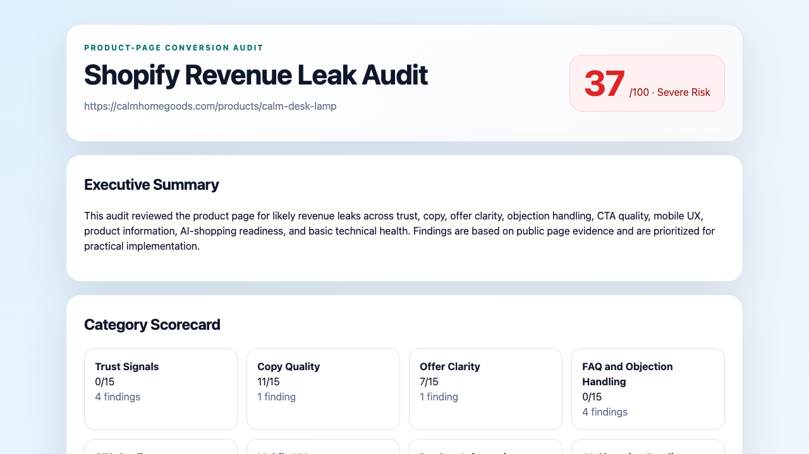
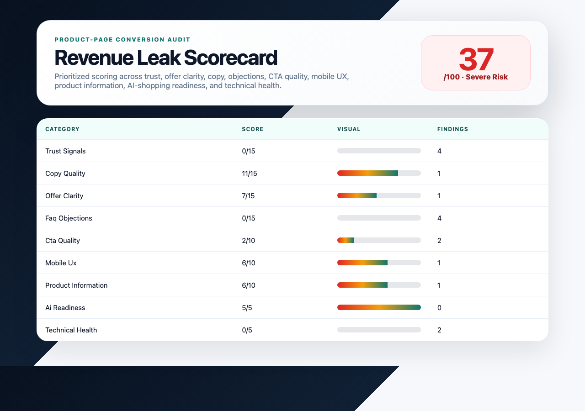
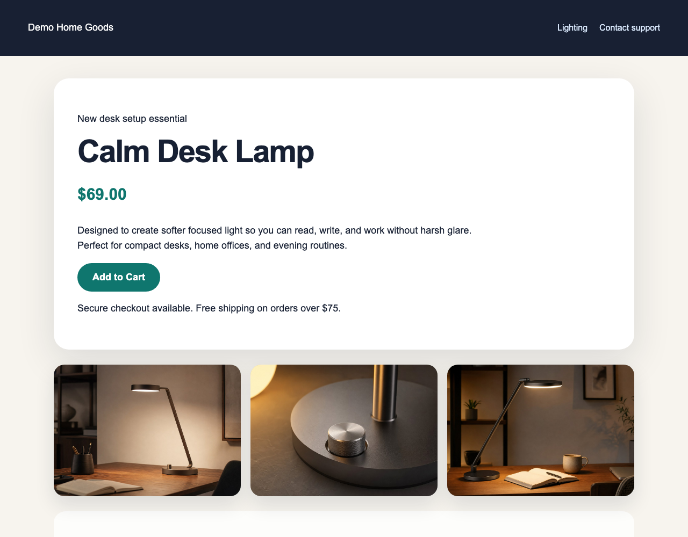
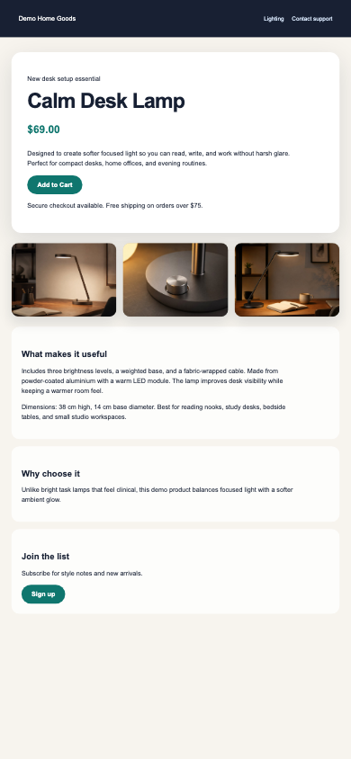

# Shopify Revenue Leak Auditor


Browser-based Shopify audit tool that identifies likely ecommerce revenue leaks and generates client-ready Markdown/HTML reports.

Use it to load a public Shopify product page, capture evidence, extract page content, run structured checks, score likely revenue leaks, and export reports that a human can review before sending to a client.

**Role:** browser capture, audit rules, scoring, report generation and CLI/API delivery. **Status:** an SM Systems audit-assistance tool; the published sample uses fictional fixtures and does not claim measured revenue gains.

## Why This Exists

Many ecommerce stores send paid and organic traffic to product pages that do not clearly answer buyer objections, explain the offer, show trust signals, or support mobile purchase behavior.

This tool automates the first-pass audit process so a consultant, freelancer, or agency can quickly produce a human-review-ready fix list covering:

- trust and reassurance gaps
- weak product-page copy
- unclear offers or purchase terms
- missing FAQ/objection handling
- CTA and mobile UX problems
- incomplete product information
- AI-shopping/product-discovery readiness
- basic technical health issues that affect audit quality

It does not claim to replace human CRO judgement. It gives the reviewer structured evidence, a scorecard, and a report draft.

## What It Audits

The auditor checks public page evidence across these categories:

| Category | What it looks for |
|---|---|
| Trust Signals | shipping, returns, guarantees, reviews, support, payment/security reassurance |
| Copy Quality | thin descriptions, feature-heavy wording, missing benefits, unclear use cases |
| Offer Clarity | price visibility, discount language, variants, shipping thresholds, purchase clarity |
| FAQ / Objections | shipping time, returns, sizing/fit, materials, warranty, buyer questions |
| CTA Quality | add-to-cart/buy-now detection, CTA count, generic CTA language, competing CTAs |
| Mobile UX | mobile screenshot presence, CTA visibility risk, popup/promo distraction signals |
| Product Information | title, images, image alt text, specs, materials, dimensions, use-case clarity |
| AI-Shopping Readiness | structured answers, buyer-intent language, Product schema, FAQ-like content |
| Technical Health | title/meta/canonical detection, structured data, load/extraction quality |

## Example Output

Each audit can produce:

- `audit_data.json` - structured audit result, extracted evidence, findings, scorecard, and output paths
- `audit_report.md` - client-readable Markdown report
- `audit_report.html` - styled HTML report suitable for review or screenshots
- `screenshots/desktop.png` - desktop page evidence
- `screenshots/mobile.png` - mobile page evidence

Public-safe demo artifacts are committed under `examples/sample_outputs/`:

- [Structured audit data](examples/sample_outputs/demo-product-audit/audit_data.json)
- [Sample Markdown report](examples/sample_outputs/demo-product-audit/audit_report.md)
- [Sample HTML report source](examples/sample_outputs/demo-product-audit/audit_report.html)
- [Desktop page evidence](examples/sample_outputs/demo-product-audit/screenshots/desktop.png)
- [Mobile page evidence](examples/sample_outputs/demo-product-audit/screenshots/mobile.png)
- [Report overview](examples/sample_outputs/demo-product-audit/screenshots/report-overview.png)
- [Scorecard](examples/sample_outputs/demo-product-audit/screenshots/scorecard.png)

The sample is generated from fictional fixture data in `examples/sample_inputs/` and does not include private client data, Shopify credentials, or revenue-improvement claims.

## Screenshots

The committed demo includes screenshot assets showing the generated audit report and product-page evidence captures.

### Report overview



### Scorecard preview



### Product page evidence captures

| Desktop capture | Mobile capture |
|---|---|
|  |  |

Original generated screenshots are also retained under `examples/sample_outputs/demo-product-audit/screenshots/`.

## Quickstart

```bash
python -m venv .venv
source .venv/bin/activate
pip install -e .
python -m playwright install chromium
shopify-audit audit-url "https://example-store.com/products/example-product"
```

Regenerate the committed demo sample locally:

```bash
source .venv/bin/activate
python examples/generate_sample_outputs.py
```

The sample generator uses deterministic fixture HTML and does not require network access, Shopify credentials, or LLM API keys.

## CLI Usage

Print the installed version:

```bash
shopify-audit version
```

Audit one URL:

```bash
shopify-audit audit-url "https://example-store.com/products/example-product"
```

Choose an output directory:

```bash
shopify-audit audit-url "https://example-store.com/products/example-product" --output-dir output
```

Audit a batch file with one URL per line:

```bash
shopify-audit audit-batch examples/sample_inputs/urls.txt
```

Generate a demo audit through the CLI:

```bash
shopify-audit demo
```

The CLI demo uses packaged fictional page data. It is deterministic, works
offline, and exercises the same extraction, checks, scoring, and reporting
pipeline as a live audit. Live `audit-url` and `audit-batch` commands require
Chromium; a page-load failure writes the partial diagnostic artifacts and exits
with status `2`.

The released CLI and API are rule-based and do not require API keys. Internal
LLM interfaces are retained as an extension point, but no provider integration
or simulated provider output is exposed as a product feature.

## Audit Methodology

The audit workflow is evidence-first:

1. Validate and normalize the input URL.
2. Load the public page with browser automation.
3. Capture desktop and mobile screenshots.
4. Extract visible text, headings, buttons, links, image metadata, prices, and page metadata.
5. Detect product-page signals such as add-to-cart buttons, price presence, variant language, and structured data.
6. Run rule-based checks across the audit categories.
7. Score findings using category weights and severity penalties.
8. Generate Markdown and HTML reports.
9. Keep all claims framed as likely risks or improvement opportunities pending human review.

See [Audit methodology](docs/AUDIT_METHODOLOGY.md) for the full methodology.

## Scoring Model

The overall score is out of 100. Findings reduce category scores according to severity, capped by category weight.

| Category | Weight |
|---|---:|
| Trust Signals | 15 |
| Copy Quality | 15 |
| Offer Clarity | 15 |
| FAQ / Objection Handling | 15 |
| CTA Quality | 10 |
| Mobile UX | 10 |
| Product Information Quality | 10 |
| AI-Shopping Readiness | 5 |
| Technical Health | 5 |

Score labels:

- 90-100: Strong
- 75-89: Good
- 60-74: Moderate Risk
- 40-59: High Risk
- 0-39: Severe Risk

See [Scoring rubric](docs/SCORING_RUBRIC.md) for severity levels and interpretation.

## API Service Mode

The CLI remains the default interface, but the project also includes an optional local FastAPI wrapper for demos and lightweight integrations.

```bash
pip install -e '.[api]'
shopify-audit-api
```

Then call `POST http://127.0.0.1:8765/audit` with a JSON body containing a product-page URL. See `docs/API_SERVICE.md` for request/response examples and safety notes.

## Documentation

- [Project overview](docs/PROJECT_OVERVIEW.md) - motivation, use cases, architecture, and workflow
- [Audit methodology](docs/AUDIT_METHODOLOGY.md) - audit categories, rule-based checks, and evidence-first approach
- [Scoring rubric](docs/SCORING_RUBRIC.md) - weights, severity penalties, score labels, interpretation
- [Client report example](docs/CLIENT_REPORT_EXAMPLE.md) - client-style deliverable example
- [API service](docs/API_SERVICE.md) - optional local FastAPI service mode
- [Client requirements](docs/CLIENT_REQUIREMENTS.md) - client intake checklist for audit delivery
- [Limitations](docs/LIMITATIONS.md) - public-page-only boundaries and safe-use notes

## Limitations

This tool uses public page analysis. It does not access private Shopify analytics, checkout analytics, heatmaps, session recordings, customer behavior recordings, inventory data, or ad account performance unless a separate approved integration is added.

The report identifies likely conversion risks and improvement opportunities based on public evidence. It does not guarantee revenue improvement, conversion-rate lift, or customer behavior outcomes.

Human review is recommended before sending any generated report to a client.

## Disclaimer

This software is provided for audit-assistance and educational purposes. It does not provide financial advice, legal advice, or guaranteed revenue outcomes.
